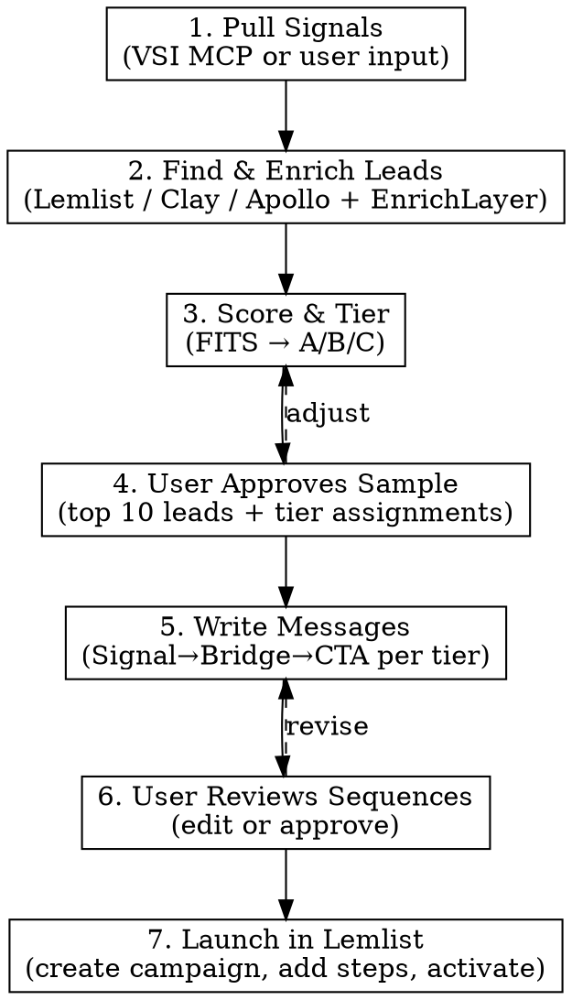

# Pain-First Outreach

One skill, one flow: market signals in, live campaign out. The gap between "we learned X from calls" and "X is in our outreach" should be minutes.

## Channel default: LinkedIn-first

**Always write LinkedIn outreach first.** LinkedIn connection requests are the primary, default deliverable of this skill — capped at **200 characters max, no exceptions**. Email is a supplementary channel.

At session start (see "Session start" below), ask the user explicitly:

> "Is this outreach for **LinkedIn**, **email**, or **both**?"

- **LinkedIn (default)** → write LinkedIn-only sequence. Connection request as Step 1, DM as Step 2, etc. All connection requests ≤ 200 chars.
- **Email** → write email-only sequence. LinkedIn is omitted.
- **Both** → LinkedIn is still drafted **first** (it's the easiest discovery surface). Email is layered in as a parallel/follow-up channel.

If the user does not answer, default to LinkedIn-only.

The 200-character cap on LinkedIn connection requests is a hard rule. Count characters before finalizing every connection request. If you go over, trim the least specific phrase first. Never ship a connection request at 201+ chars.

## How it works

The engine runs 7 phases in order. Each phase feeds the next. You can enter at any phase if the user already has outputs from earlier phases (e.g., they already have a lead list).



---

## Phase 1: Pull signals

Signals are the foundation — every message in the campaign traces back to a real pain pattern.

**Primary: VSI MCP** (if connected)

Pull directly from VSI. Read `references/vsi-integration.md` for exact tool calls. Fetch in this order:
1. **Signals** — filter by `signal_type: pain_point` and `status: validated` or `emerging`. These become your message hooks.
2. **Artifacts** — pull `icp` artifact for targeting criteria, `objection_matrix` for pre-emption, `positioning` for framing.
3. **Reflections** — pull `aggregated_reflections` filtered to `hurt` and `missed` directions for recent behavioral patterns.

**Fallback: user input**

If VSI MCP is not connected, ask the user:
> "Feed me the signal data — paste a VSI export, call notes, or describe what's been coming up in conversations."

Extract from whatever they provide:
- **Pain points**: what prospects struggle with (direct quotes > paraphrases)
- **Triggers**: business events creating urgency (funding, hiring, missed targets)
- **Objections**: what makes them hesitate
- **ICP patterns**: firmographic/behavioral traits of best-fit prospects
- **Proof points**: outcomes or stats that support positioning

If signals are thin, ask for 2-3 call excerpts. Never fabricate signals.

---

## Phase 2: Find and enrich leads

Use the signals and ICP from Phase 1 to build a lead list. The user chooses the tool (ask if unclear):

| Tool | When to use | How |
|------|------------|-----|
| **Lemlist** (default) | Primary lead search + campaign tool | Search via Lemlist MCP |
| **Clay** | Deep enrichment, waterfall search | User provides Clay table or export |
| **Apollo** | Large-volume prospecting | User provides Apollo export or API |
| **EnrichLayer** | Company/lead enrichment layer | Call EnrichLayer API to fill gaps |

Read `references/lead-tools.md` for integration details per tool.

**User brings their own list?** The engine accepts lead lists at any completeness level:

- **Company names only** (e.g., CSV with 100 company names): Enrich companies first (EnrichLayer → domain, size, funding), then search for the right contacts at each company using ICP title criteria (via Lemlist/Apollo/Clay), then enrich contacts (email, LinkedIn URL).
- **Company + name + role** (partially complete): Skip company search — go straight to contact enrichment (find verified email, LinkedIn URL, fill company data gaps via EnrichLayer).
- **Full lead list with emails**: Minimal enrichment needed — just fill gaps for FITS scoring (company size, funding stage) and deduplicate.

**Enrichment flow (regardless of starting point):**
1. Assess what's missing from the lead data
2. Ask user for **credit cap** (default: 50 API calls) — never exceed it
3. Enrich companies via EnrichLayer (only fields needed for FITS scoring — skip redundant company lookups)
4. Find/verify contacts via Lemlist, Clay, or Apollo if needed
5. Deduplicate against existing Lemlist campaigns and any DNC list the user provides
6. Present a sample of 10-15 leads for user review before proceeding

**Enrichment resilience (non-negotiable):**
- Retry 429s with exponential backoff (2s → 4s → 8s → 16s)
- Stop immediately on 403 (insufficient credits) — save what you have
- Save results after every batch of 5 leads (never at the end only)
- Support resume — skip already-enriched leads if output file exists
- Track and display API call count against the credit cap

See `references/lead-tools.md` → EnrichLayer → Resilience rules for implementation details.

---

## Phase 3: Score and tier leads

Apply the **FITS framework** to each lead:

| Dimension | Measures | Weight |
|-----------|----------|--------|
| **F**it | Firmographic match to ICP (stage, sector, size) | 30% |
| **I**ntent | Signals they're actively seeking a solution | 45% |
| **T**iming | In a decision window (trigger event, budget cycle) | Qualifier |
| **S**takeholder | Right person to reach first | Qualifier |

Score Fit (1-3) and Intent (1-3), compute weighted score:
- **Tier A** (score >= 2.5): Full 6-step sequence across email + LinkedIn + WhatsApp. Account-level personalization.
- **Tier B** (1.5-2.4): 4-step sequence, email + LinkedIn. Segment-level personalization.
- **Tier C** (< 1.5): 2-step email test. Pattern-level signal only. If reply rate > 3%, promote to Tier B.

---

## Phase 4: User approves sample

Before writing any messages, present:
- Top 10 scored leads with their tier assignments
- The pain signals you'll use as hooks (from Phase 1)
- The sequence structure per tier (number of steps, channels, timing)

Wait for user confirmation. They may adjust tiers, remove leads, or redirect the signal angle.

---

## Phase 5: Write messages

For each tier, write the full sequence using **Signal -> Bridge -> CTA**.

**The iron rule of Step 1:** Open with a pain pattern from VSI signals. Never a trigger event. Never a pitch. Never flattery. The reader should think "how do they know this about my situation?" — not "what are they selling?"

**The iron rule of every step — discovery, not pitch:** This is a discovery campaign. Every message validates the pain pulled from VSI signals — it does not present, demo, or even soft-pitch the founder's solution. Late-step variation comes from a sharper version of the same pain, a new framing, or asking how they handle it today. Never from a solution reveal, case study, or product proof. The CTA across all steps stays in the validate-pain register: "compare notes", "hear your take", "15 mins to talk through it" — never "show you what we built", "see a demo", "pilot."

- **Signal**: A specific pain observation. ("We've been hearing from a lot of [persona] at [stage] that X is becoming a real blocker...")
- **Bridge**: Connect to their situation without assuming. ("Given [context], I'd guess...")
- **CTA**: One low-friction ask. ("Worth 15 mins to compare notes?")

**Sequence structure by tier and channel choice:**

Sequence structure depends on the channel chosen at session start. **LinkedIn is always written first** within any given sequence.

**LinkedIn-only (default channel choice):**

Tier A (4 steps, LinkedIn):
```
Day 1  — LinkedIn: connection request (≤200 chars, pain-first)
Day 3  — LinkedIn DM (after accept): conversation opener, sharper pain framing
Day 8  — LinkedIn DM: new angle on the same pain
Day 14 — LinkedIn DM: clean breakup, one last validation question
```

Tier B (3 steps, LinkedIn):
```
Day 1  — LinkedIn: connection request (≤200 chars)
Day 4  — LinkedIn DM (after accept): conversation opener
Day 10 — LinkedIn DM: one follow-up, then done
```

Tier C (2 steps, LinkedIn):
```
Day 1  — LinkedIn: connection request (≤200 chars)
Day 7  — LinkedIn DM: one follow-up, then done
```

**Email-only (if user picks email):**

Tier A (4 steps): Day 1 cold opener → Day 4 new angle → Day 9 sharper pain framing → Day 14 breakup.
Tier B (3 steps): Day 1 cold opener → Day 5 new angle → Day 11 breakup.
Tier C (2 steps): Day 1 cold opener → Day 6 one follow-up.

**Both (LinkedIn + email):**

LinkedIn is drafted **first** as the lead channel. Email runs in parallel as a second touch.

Tier A (6 steps):
```
Day 1  — LinkedIn: connection request (≤200 chars, pain-first)  ← lead channel
Day 2  — Email: pain-first opener
Day 5  — LinkedIn DM (after accept): conversation opener
Day 8  — Email: new angle
Day 12 — LinkedIn DM: sharper pain framing
Day 16 — Email: breakup
```

Tier B (4 steps):
```
Day 1  — LinkedIn: connection request (≤200 chars)  ← lead channel
Day 3  — Email: pain-first opener
Day 7  — LinkedIn DM (after accept)
Day 11 — Email: breakup
```

Tier C (2 steps):
```
Day 1  — LinkedIn: connection request (≤200 chars)  ← lead channel
Day 6  — Email: one follow-up
```

Read `references/message-frameworks.md` for channel-specific rules, character limits, and worked examples.

**LinkedIn 200-char cap:** Connection requests are **hard-capped at 200 characters**, regardless of LinkedIn plan tier. This is enforced as the skill's universal default — even on plans that allow 300, stay at 200. Count characters before shipping every request. Trim the least specific phrase if over.

---

## Phase 6: User reviews sequences

Present each sequence clearly, labeled by channel:

```
[Email — Step 1, Day 1]
Subject: ...
Body: ...

[LinkedIn — Step 2, Day 3]
Connection request: ...

[Email — Step 3, Day 5]
Subject: ...
Body: ...
```

The user may edit messages, swap angles, adjust timing, or approve as-is. Incorporate changes before proceeding.

---

## Phase 7: Launch in Lemlist

**Default: push directly to Lemlist via MCP.** Only export to file if the user asks or Lemlist MCP is unavailable.

1. Confirm campaign name with the user
2. Create the campaign in Lemlist
3. Add all steps (email, LinkedIn, WhatsApp) with copy and delays
4. Add leads from Phase 2 (or confirm user will add manually)
5. Activate the campaign
6. Return the Lemlist campaign URL

Read `references/lemlist-campaigns.md` for exact MCP commands.

**If Lemlist MCP is not configured:**
```bash
npx @lemlist/mcp-server --api-key $LEMLIST_API_KEY
```

**If user requests file export:** Write to `./campaign-export-[YYYYMMDD].json`.

---

## Session start

When invoked, ask three things:

1. **"What's the goal?"** — book calls, generate demo signups, re-engage cold leads, validate a new segment, etc.
2. **"Is this outreach for LinkedIn, email, or both?"** — default to **LinkedIn** if the user doesn't answer or is unsure. LinkedIn is always written first; all connection requests are capped at 200 chars.
3. **"Do you have signal data, or should I pull from VSI?"** — if VSI MCP is connected, pull directly. Otherwise, ask them to paste or describe.

Then run Phases 1-7, structuring Phase 5 sequences according to the channel choice from question 2.

**Entry points:** Users can enter at any phase:
- "I already have leads, just write the messages" → skip to Phase 5
- "Here are my signals, find me leads" → start at Phase 2
- "I have sequences written, push them to Lemlist" → skip to Phase 7

---

## Reference files

- `references/vsi-integration.md` — VSI MCP tool calls, signal types, filtering patterns
- `references/lead-tools.md` — Lemlist, Clay, Apollo, EnrichLayer integration details
- `references/message-frameworks.md` — Signal->Bridge->CTA, channel rules, character limits, archetypes
- `references/lemlist-campaigns.md` — Lemlist MCP commands for campaign creation and launch
