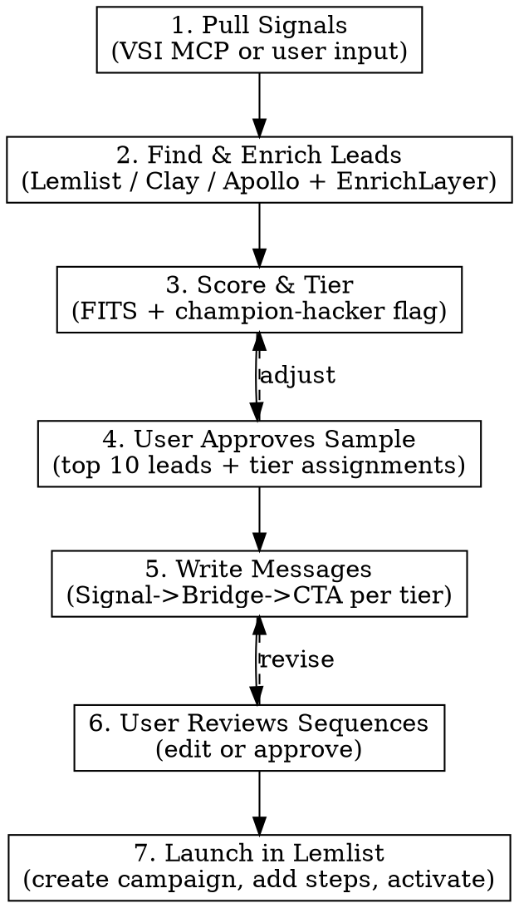

# Pain-First Outreach

One skill, one flow: market signals in, live campaign out. The gap between "we learned X from calls" and "X is in our outreach" should be minutes.

## Context: this is pre-product research, not sales

There is no product yet. Every campaign this skill produces is a research campaign. The goal is to find people who care enough about a specific pain to talk about it, not to sell anything.

**Two target tiers inside every campaign:**

1. **Primary target: champions already hacking their own solution.** People who have built a workaround (spreadsheet, internal tool, repurposed product, manual process) because the pain hurts enough to act on. These are the highest-signal contacts. They can become design partners, first customers, or interview gold. Look for: mentions of stitched-together stacks, internal tools, "we built this ourselves," repurposed software, custom workflows.
2. **Secondary target: pain-aware but not yet acting.** People who clearly feel the pain in their role but have not built anything around it. Lower signal but much larger pool. Look for: role-specific complaints, recent role changes or scaling events that expose the pain, public conversations about the problem.

Both tiers stay inside the same campaign. The primary tier gets the headline framing ("most people I talk to who try to solve this themselves end up..."). The secondary tier gets the universal framing ("most people in your seat hit this wall..."). The CTAs for both stay in research register.

**No solution language, ever.** Never imply we have a fix, a benchmark, a case study, or a tool. The CTA is always research-shaped: "compare notes", "hear how you're handling it", "15 mins to talk through it." Never "see how to reduce X by Y%." There is no Y.

## Always address the prospect by name

Every first message (LinkedIn connection request, opening DM, cold email) must address the prospect by name. The opener pattern is:

`Hi [Name], [signal] [bridge] [CTA]`

or

`[Name], [signal] [bridge] [CTA]`

"Pain-first" means the *subject* of the message is the prospect's pain. It does not mean the literal first words must be about the pain. Skipping the name reads as broadcast and loses the personal frame. The 200-char cap still applies, so count characters after adding the name and trim the least specific phrase if over.

## Always present two first-message options

For every first message (LinkedIn connection request, cold email opener), present **two versions side by side**:

1. **Without referral remix** (pure pain-led opener)
2. **With referral remix** (soft "a colleague flagged you as [recognition]" hook prepended)

Not every user is comfortable with the referral angle, so the choice is theirs to make. Show both with char counts. The user picks one per lead (or per segment).

If the core message is already at 170+ chars and the referral version can't fit under 200 even after trimming fillers, say so explicitly and offer only the without-referral version.

### Referral remix rules

The referral phrase must include a **recognition payoff**: it explains why a colleague flagged this person. We are pre-product, so we cannot offer product value or information value in a first message. The only honest currency we have is **emotional value**: recognising the prospect as one of the sharper / more thoughtful / more genuinely engaged people in the space. That is what earns the read.

Good referral framings (always include a recognition element):
- "A colleague flagged you as one of the sharper [persona] thinking about [topic],"
- "A teammate kept seeing your name come up when looking at thoughtful [persona] on [topic],"
- "A colleague mentioned you as one of the few [persona] actually [verb-phrase about the pain],"
- "Someone on my team flagged you as a [persona] who's been genuinely wrestling with [pain],"

Bad referral framings (no value to the prospect):
- "A teammate flagged your name while mapping [vertical] leads" (no why)
- "A colleague passed me your profile" (bare, no recognition)

The recognition must be **defensible**: the user should be able to point to *something* about the prospect (their LinkedIn activity, posts, talks, role, public work) that plausibly justifies the compliment. Never recognise someone for something they didn't do. Avoid fawning words ("brilliant", "incredible", "world-class"); use restrained recognition ("sharper", "thoughtful", "genuinely", "actually", "few people who").

First message only, never repeat in DMs or follow-ups.

### Trimming and brevity discipline

Write tight on the first draft. Aim for 140-170 chars on the core (pre-referral) so the referral version still fits under 200. If a draft goes over the cap, trim in this priority order:

**Cut first (fillers, hedges, softeners):**
- "we talk to", "honestly", "just", "really", "actually"
- "at your stage", "right now", "these days" (only if the timing isn't load-bearing)
- "I'd guess", "I'd imagine", "I suspect" (often replaceable with a direct claim)
- "in order to" -> "to", "have been doing" -> "do", "is becoming" -> "becomes"
- Repeated qualifiers ("supply chain leaders in supply chain") -> dedupe
- "and"-joins of two ideas where one already lands

**Keep at all costs:**
- The prospect's name
- The specific pain mechanic (the exact noun/verb that makes them feel seen)
- Verbatim numbers from VSI signals
- Role/persona descriptor ("COOs", "supply chain leads")
- The CTA question

**Sensible abbreviations:**
- Drop "the" before plurals when meaning is preserved ("the knock-ons" -> "knock-ons")
- "Most X end up doing Y" is tighter than "Most X tend to end up doing Y"
- Industry shorthand if the persona uses it ("CRMA", "GTM", "HRIS")

Never trim by removing the pain specificity. If the only way to fit the referral is to gut the pain language, drop the referral instead. The pain is the point.

See `references/message-frameworks.md` for worked examples and a longer trim cheatsheet.

## Channel default: LinkedIn-first

**Always write LinkedIn outreach first.** LinkedIn connection requests are the primary, default deliverable of this skill, capped at **200 characters max, no exceptions**. Email is a supplementary channel.

At session start (see "Session start" below), ask the user explicitly:

> "Is this outreach for **LinkedIn**, **email**, or **both**?"

- **LinkedIn (default)**: write LinkedIn-only sequence. Connection request as Step 1, DM as Step 2, etc. All connection requests ≤ 200 chars.
- **Email**: write email-only sequence. LinkedIn is omitted.
- **Both**: LinkedIn is still drafted **first** (it's the easiest discovery surface). Email is layered in as a parallel/follow-up channel.

If the user does not answer, default to LinkedIn-only.

The 200-character cap on LinkedIn connection requests is a hard rule. Count characters before finalizing every connection request. If you go over, trim the least specific phrase first. Never ship a connection request at 201+ chars.

## How it works

The engine runs 7 phases in order. Each phase feeds the next. You can enter at any phase if the user already has outputs from earlier phases (e.g., they already have a lead list).



---

## Phase 1: Pull signals

Signals are the foundation. Every message in the campaign traces back to a real pain pattern.

**Primary: VSI MCP** (if connected)

Pull directly from VSI. Read `references/vsi-integration.md` for exact tool calls. Fetch in this order:
1. **Signals**: filter by `signal_type: pain_point` and `status: validated` or `emerging`. These become your message hooks.
2. **Artifacts**: pull `icp` artifact for targeting criteria, `objection_matrix` for pre-emption, `positioning` for framing.
3. **Reflections**: pull `aggregated_reflections` filtered to `hurt` and `missed` directions for recent behavioral patterns.

**Fallback: user input**

If VSI MCP is not connected, ask the user:
> "Feed me the signal data: paste a VSI export, call notes, or describe what's been coming up in conversations."

Extract from whatever they provide:
- **Pain points**: what prospects struggle with (direct quotes > paraphrases). Carry any specific numbers verbatim (e.g., "60 days to onboard", "two workdays per week lost"). Specificity is what makes a prospect feel seen.
- **Hack patterns**: any mention of how people are solving the pain today (spreadsheets, internal tools, stitched stacks). These power the champion-hacker message variant.
- **Triggers**: business events creating urgency (funding, hiring, missed targets). Triggers tell you *who* and *when*, never the hook.
- **Objections**: what makes them hesitate.
- **ICP patterns**: firmographic/behavioral traits of best-fit prospects.

If signals are thin, ask for 2-3 call excerpts. Never fabricate signals or numbers.

---

## Phase 2: Find and enrich leads

Use the signals and ICP from Phase 1 to build a lead list. **Default to cheap mode** unless the user already has Lemlist or asks for the full stack.

### Cheap mode (default, $0 to start)

**Tool: EnrichLayer only.** EnrichLayer is not just an enrichment layer; its `find_company_role` tool can source contacts directly. Combined with manual LinkedIn outreach in Phase 7, this lets a user run the entire skill with zero paid subscriptions.

Flow:
1. Ask the user for a list of **target company names** (manually picked, scraped from a public list, or pulled from any source). 10-30 companies is enough to validate.
2. For each company, call `find_company_role` with the ICP title from Phase 1 to surface the right contact.
3. Call `enrich_company` to fill firmographic gaps needed for FITS scoring.
4. Call `get_profile_email` only if the user picked email-only channel mode (LinkedIn-only doesn't need email).
5. Tag each lead with `champion_hacker: true | false | unknown` based on visible hack-pattern signals (LinkedIn posts about internal tools, job ads for ops engineers, public stack mentions).

**Activation cost:** EnrichLayer offers free credits on signup at `enrichlayer.com`, typically enough for the first campaign. If the user hasn't signed up yet, prompt them to before starting Phase 2.

### Extensive mode (on user request)

For users with Lemlist already, or who want to run high-volume / multi-channel campaigns:

| Tool | When to use | How |
|------|------------|-----|
| **Lemlist** | Primary lead search + campaign delivery | Search via Lemlist MCP |
| **Clay** | Deep waterfall enrichment | User provides Clay table or export |
| **Apollo** | Large-volume prospecting | User provides Apollo export or API |
| **EnrichLayer** | Gap-fill after Lemlist/Clay/Apollo search | Call EnrichLayer API for missing fields |

Only suggest the upgrade tool the user actually needs:
- More volume than EnrichLayer free credits allow -> Apollo or paid EnrichLayer tier.
- Want automation instead of manual LinkedIn -> Lemlist.
- Need deeper firmographic / tech-stack data -> Clay.

Don't push the full stack on users still in validation mode.

Read `references/lead-tools.md` for integration details per tool.

**User brings their own list?** The engine accepts lead lists at any completeness level:

- **Company names only** (e.g., CSV with 100 company names): Enrich companies first (EnrichLayer for domain, size, funding), then search for the right contacts at each company using ICP title criteria (via Lemlist/Apollo/Clay), then enrich contacts (email, LinkedIn URL).
- **Company + name + role** (partially complete): Skip company search. Go straight to contact enrichment (find verified email, LinkedIn URL, fill company data gaps via EnrichLayer).
- **Full lead list with emails**: Minimal enrichment needed. Just fill gaps for FITS scoring (company size, funding stage) and deduplicate.

**Enrichment flow (regardless of starting point):**
1. Assess what's missing from the lead data.
2. Ask user for **credit cap** (default: 50 API calls). Never exceed it.
3. Enrich companies via EnrichLayer (only fields needed for FITS scoring, skip redundant company lookups).
4. Find/verify contacts via Lemlist, Clay, or Apollo if needed.
5. Where possible, capture champion-hacker signal: does this person or company show public signs of building their own workaround? (recent posts about internal tools, job ads for ops engineers, podcast mentions, stack disclosures). Tag the lead `champion_hacker: true | false | unknown`.
6. Deduplicate against existing Lemlist campaigns and any DNC list the user provides.
7. Present a sample of 10-15 leads for user review before proceeding.

**Enrichment resilience (non-negotiable):**
- Retry 429s with exponential backoff (2s, 4s, 8s, 16s).
- Stop immediately on 403 (insufficient credits) and save what you have.
- Save results after every batch of 5 leads (never at the end only).
- Support resume: skip already-enriched leads if output file exists.
- Track and display API call count against the credit cap.

See `references/lead-tools.md` for implementation details on EnrichLayer resilience.

---

## Phase 3: Score and tier leads

Apply the **FITS framework** to each lead:

| Dimension | Measures | Weight |
|-----------|----------|--------|
| **F**it | Firmographic match to ICP (stage, sector, size) | 30% |
| **I**ntent | Signals they're actively wrestling with the pain | 45% |
| **T**iming | In a decision window (trigger event, budget cycle) | Qualifier |
| **S**takeholder | Right person to reach first | Qualifier |

Score Fit (1-3) and Intent (1-3), compute weighted score:
- **Tier A** (score >= 2.5): Full sequence across primary channel(s). Account-level personalization.
- **Tier B** (1.5-2.4): Mid-length sequence. Segment-level personalization.
- **Tier C** (< 1.5): Short test sequence. Pattern-level signal only. If reply rate > 3%, promote to Tier B.

**Champion-hacker boost:** If a lead is tagged `champion_hacker: true`, bump them one tier (C to B, B to A). They are by definition higher-intent.

---

## Phase 4: User approves sample

Before writing any messages, present:
- Top 10 scored leads with their tier assignments and champion-hacker flag.
- The pain signals you'll use as hooks (from Phase 1).
- The sequence structure per tier (number of steps, channels, timing).
- Which message variant each lead will get (champion-hacker or pain-aware).

Wait for user confirmation. They may adjust tiers, remove leads, swap variants, or redirect the signal angle.

---

## Phase 5: Write messages

**Default output: Day 1 first message only.** Generate just the LinkedIn connection request (or cold email opener if the user picked email-only). Do **not** auto-generate Days 3, 8, 14 DMs or follow-up emails. After presenting the Day 1 options, explicitly ask: "Want me to draft Day 3 / Day 8 / Day 14 too, or are we shipping the first message only?" The user decides.

This default exists because most validation cycles only need to test the first message. Generating the full sequence upfront slows the feedback loop and inflates review effort. The sequence structures below (Tier A / B / C, LinkedIn-only / email-only / both) describe what the skill *can* produce on request; they are not the default output.

For each tier, write the **first message** using **Signal -> Bridge -> CTA**, addressing the prospect by name in the opener.

**Iron rule of Step 1:** Address by name, then open with a pain pattern from VSI signals. Never a trigger event as the hook. Never a pitch. Never flattery. The reader should think "how do they know this about my situation?", not "what are they selling?"

**Iron rule of every step, discovery only:** This is a research campaign for a product that does not exist yet. Every message validates the pain pulled from VSI signals. It does not present, demo, or even soft-pitch a future solution. Late-step variation comes from a sharper version of the same pain, a different facet of the same root pain (cost / process / productivity / team friction), or asking how they handle it today. Never from a solution reveal, case study, product proof, or benchmark. The CTA across all steps stays in the validate-pain register: "compare notes", "hear your take", "15 mins to talk through it". Never "show you what we built", "see how to reduce X by Y%", "see a demo", "pilot."

**Two message variants per step:**

For each step in the sequence, draft both:
- **Champion-hacker variant**: speaks to people already building their own workaround. Validates the hack pattern, asks how they built it, asks what's still broken.
- **Pain-aware variant**: speaks to people who feel the pain but haven't acted on it. Validates that the pain exists in their seat, asks how they manage today.

Assign variant per lead based on the `champion_hacker` flag from Phase 2.

**Signal -> Bridge -> CTA components:**

- **Signal**: A specific pain observation. Carry any verbatim numbers from VSI signals. ("Most [persona] at [stage] hit a wall around X" / "Pattern keeps coming up: people at your stage end up doing X manually because Y").
- **Bridge**: Connect to their situation without assuming. ("Given you're at [stage], I'd guess..." / "For teams in [context], this usually shows up as..."). Champion-hacker variant adds a reference to the hack pattern: "most folks I talk to have a spreadsheet doing this, and it falls over once you hit X."
- **CTA**: One low-friction research ask, written as a full conversational question. Good: "Match what you're seeing?" / "Familiar pattern, or different on your end?" / "Where does that start to break for you?" / "How are you handling it today?". Never solution-flavored. Never AI-shorthand ("Match yours?", "Sound familiar?", "Resonate?"). The closing question must pass two tests: (1) would a real person say this out loud, (2) is the subject of the question unambiguous. See `references/message-frameworks.md` for the full good/bad list.

**Subject line shapes (email only):**
- Pain-as-question: `"Is onboarding still a 60-day slog?"`
- Pain-as-statement: `"Most COOs can't see their own skills bench"`
- Under 7 words. A/B test 2 variants in Lemlist.

**Sequence structure by tier and channel choice:**

Sequence structure depends on the channel chosen at session start. LinkedIn is always written first within any given sequence.

**LinkedIn-only (default channel choice):**

Tier A (4 steps):
```
Day 1  | LinkedIn connection request | <=200 chars, pain-first, addresses by name
Day 3  | LinkedIn DM after accept    | conversation opener, sharper pain framing
Day 8  | LinkedIn DM                 | new facet of the same pain
Day 14 | LinkedIn DM                 | clean breakup, one last validation question
```

Tier B (3 steps):
```
Day 1  | LinkedIn connection request | <=200 chars, pain-first, addresses by name
Day 4  | LinkedIn DM after accept    | conversation opener
Day 10 | LinkedIn DM                 | one follow-up, then done
```

Tier C (2 steps):
```
Day 1  | LinkedIn connection request | <=200 chars
Day 7  | LinkedIn DM                 | one follow-up, then done
```

**Email-only (if user picks email):**

Tier A (4 steps): Day 1 cold opener, Day 4 new facet, Day 9 sharper pain framing, Day 14 breakup.
Tier B (3 steps): Day 1 cold opener, Day 5 new facet, Day 11 breakup.
Tier C (2 steps): Day 1 cold opener, Day 6 one follow-up.

**Both (LinkedIn + email):**

LinkedIn is drafted **first** as the lead channel. Email runs in parallel as a second touch.

Tier A (6 steps):
```
Day 1  | LinkedIn connection request | <=200 chars, lead channel
Day 2  | Email                       | pain-first opener
Day 5  | LinkedIn DM after accept    | conversation opener
Day 8  | Email                       | new facet
Day 12 | LinkedIn DM                 | sharper pain framing
Day 16 | Email                       | breakup
```

Tier B (4 steps):
```
Day 1  | LinkedIn connection request | <=200 chars, lead channel
Day 3  | Email                       | pain-first opener
Day 7  | LinkedIn DM after accept
Day 11 | Email                       | breakup
```

Tier C (2 steps):
```
Day 1  | LinkedIn connection request | <=200 chars, lead channel
Day 6  | Email                       | one follow-up
```

Read `references/message-frameworks.md` for channel-specific rules, character limits, and worked examples.

**LinkedIn 200-char cap:** Connection requests are hard-capped at 200 characters regardless of LinkedIn plan tier. Even on plans that allow 300, stay at 200. Count characters (including the name) before shipping every request. Trim the least specific phrase if over.

---

## Phase 6: User reviews sequences

Present each sequence clearly, labeled by channel and variant:

```
[LinkedIn, Step 1, Day 1, champion-hacker variant, 184 chars]
Connection request: ...

[LinkedIn, Step 1, Day 1, pain-aware variant, 178 chars]
Connection request: ...

[LinkedIn DM, Step 2, Day 3, champion-hacker variant]
Body: ...
```

Always show character counts on every LinkedIn connection request line so the user can audit at a glance. The user may edit messages, swap angles, adjust timing, or approve as-is. Incorporate changes before proceeding.

---

## Phase 7: Launch (cheap or extensive)

**Cheap mode (default): manual LinkedIn copy-paste list.** No Lemlist required. Output the drafted Day-1 messages as a clean per-lead list the user can copy and send manually on LinkedIn. Include for each lead:

- Prospect name + LinkedIn URL.
- Tier and variant chosen (champion-hacker or pain-aware).
- The connection request (with char count).
- A blank "sent? / replied?" tracking column.

Format as a Markdown table or a simple list, whichever fits the user's preference. Suggest they paste the output into a Sheet, Notion table, or Linear board to track sends and replies for the first batch.

Add a short note at the end: *"When you're ready to automate or run multi-step sequences, hook up Lemlist (see Phase 7 extensive mode)."*

**Extensive mode (on user request): push directly to Lemlist via MCP.**

1. Confirm campaign name with the user.
2. Create the campaign in Lemlist.
3. Add all steps (email, LinkedIn, WhatsApp) with copy and delays.
4. Add leads from Phase 2 (or confirm user will add manually).
5. Activate the campaign.
6. Return the Lemlist campaign URL.

Read `references/lemlist-campaigns.md` for exact MCP commands.

**If Lemlist MCP is not configured:**
```bash
npx @lemlist/mcp-server --api-key $LEMLIST_API_KEY
```

**If user requests file export:** Write to `./campaign-export-[YYYYMMDD].json`.

---

## Session start

On the **first invocation in a session**, the first user-facing output is always this intro (keep it tight):

> This skill does two things:
>
> 1. **Finds the right leads** (sourcing + enrichment).
> 2. **Writes pain-first discovery messages** from VSI signals or pasted call notes.
>
> You can run the full flow or enter at either end (just messages, just leads, or both).
>
> It works cheaply or extensively, depending on what you already have set up:
>
> - **Cheap mode (default, $0)**: EnrichLayer free credits for sourcing + manual LinkedIn outreach. Enough to validate the first ~50-100 prospects.
> - **Extensive mode (on request)**: Lemlist + optionally Clay or Apollo for high-volume search and automated multi-channel sequences.

Then ask three questions:

1. **"What's the goal?"** Book research calls, validate a new segment, find design partners, re-engage cold leads, etc. (Reminder: there is no product yet, so "demo signups" and "trial signups" are out of scope.)
2. **"Is this outreach for LinkedIn, email, or both?"** Default to LinkedIn if the user doesn't answer. LinkedIn is always written first; all connection requests are capped at 200 chars.
3. **"Do you have signal data, or should I pull from VSI?"** If VSI MCP is connected, pull directly. Otherwise, ask them to paste or describe.

Then run the relevant phases, structuring Phase 5 sequences according to the channel choice from question 2. Default to cheap mode unless the user has Lemlist configured or asks for the full stack.

**Entry points:** Users can enter at any phase:
- "I already have leads, just write the messages" goes to Phase 5.
- "Here are my signals, find me leads" goes to Phase 2.
- "I have sequences written, push them to Lemlist" goes to Phase 7.

**Skip the intro** if the user is resuming a session, has already completed Phase 4, or explicitly opens with a phase-specific request.

---

## Reference files

- `references/vsi-integration.md`: VSI MCP tool calls, signal types, filtering patterns.
- `references/lead-tools.md`: Lemlist, Clay, Apollo, EnrichLayer integration details.
- `references/message-frameworks.md`: Signal->Bridge->CTA, channel rules, character limits, archetypes, champion-hacker vs pain-aware variants.
- `references/lemlist-campaigns.md`: Lemlist MCP commands for campaign creation and launch.
